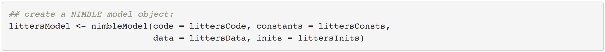
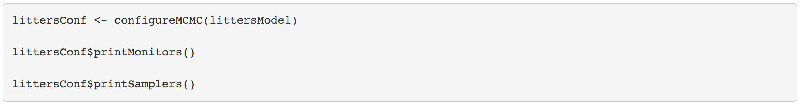
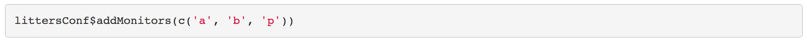
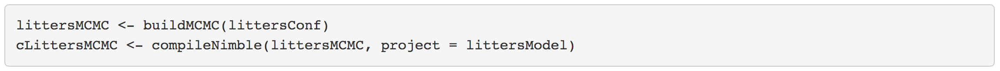
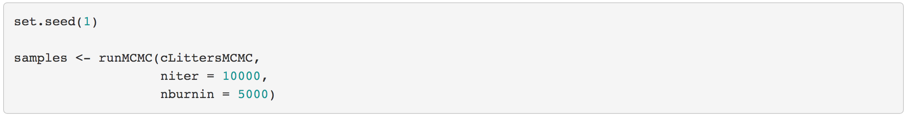

---

\   


### A very

The steps of running an MCMC are as follows:

 1. Build a model object (`nimbleModel`)
 1. Configure the MCMC (`configureMCMC`)
 1. Build the MCMC (`buildMCMC`)
 1. Create a compiled version of the MCMC (`compileNimble`)
 1. Run the MCMC (`runMCMC`)

Note that we can combine steps 1-5 by using `nimbleMCMC`, which in fact does not even require you to create the model, but if we want to modify the default MCMC configuration of samplers then we need to separate the steps.

\  

### Build the model

We first need to build the model as we did in the previous module.

<center></center>

\  

### Configuring a basic MCMC

Setting up and running an MCMC in NIMBLE in this way takes a few more steps than in BUGS or JAGS, but with the benefit of giving the user much more control of how the MCMC operates.

First we *configure* the MCMC, which means setting up the samplers to be used for each node or group of nodes. NIMBLE provides a default configuration, but we'll see shortly how you can modify that. 

<center></center>

<!--
```{r, eval = FALSE}
littersConf <- configureMCMC(littersModel)

littersConf$printMonitors()

littersConf$printSamplers()
```
-->

\  

You also specify the nodes for which you'd like to get the MCMC samples as output. (NIMBLE defaults to only monitoring the "top-level" nodes, i.e, hyperparameters with no stochastic parents.

Let's add monitors to also monitor the `p` nodes.

<center></center>

<!--
```{r, eval = FALSE}
littersConf$addMonitors(c('a', 'b', 'p'))
```
-->

\  

### Building the MCMC algorithm for the model 

Next we'll build the MCMC algorithm for the model under the default configuration. And we'll create a compiled (i.e., C++) version of the MCMC that is equivalent in functionality but will run much faster.

<center></center>

<!--
```{r, eval = FALSE}
littersMCMC <- buildMCMC(littersConf)
cLittersMCMC <- compileNimble(littersMCMC, project = littersModel)
```
-->

(The *project* argument helps us manage all the C++ that is generated for a given analysis. In general the project can be referenced using the name of the original (uncompiled) model.)

\  

### Running the MCMC

Now we're ready to run the compiled MCMC.

We don't recommend running the R version of the MCMC for very many iterations - it's really slow - in part because iterating in R is slow and in part because iterating with a model in NIMBLE requires even more overhead. 

<center></center>

<!--
```{r, eval = FALSE}
set.seed(1)

samples <- runMCMC(cLittersMCMC,
                   niter = 15000,
                   nburnin = 5000)
```
-->


\   

### Looking at summary statistics

Let's investitate the samples.


```{r, echo = FALSE, message = FALSE}
library(nimble, quiet = TRUE)
load('~/github/nimble/nimble-cefe-2019/docs/data/litters_samples.Rdata')
samples <- samplesList[[1]]
```


```{r }
dim(samples)

colnames(samples)
```

NIMBLE provides a the function `samplesSummary` for quickly looking at posterior summary statistics.

```{r }
round(samplesSummary(samples), 2)
```


\  

\  

\  

\  

\  

\  

\  

\  

\  

\  

\  

\  

\  

\  


