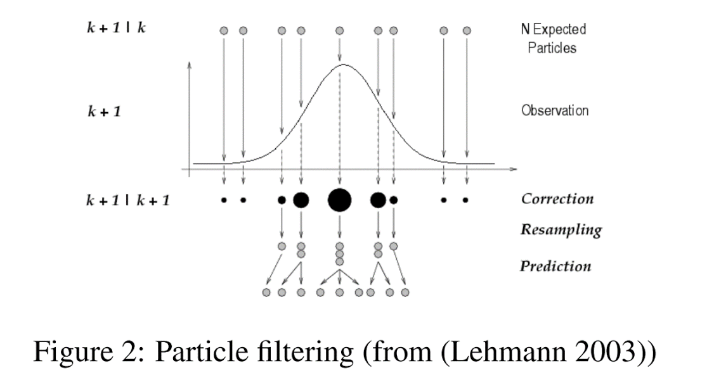

---

\   

### Sequential Monte Carlo

Sequential Monte Carlo is a family of algorithms for iteratively sampling from a posterior distribution generally in state-space style models:

$$ x_t \sim f_t(x_t | x_{t-1}, \theta) $$ 
$$ y_t \sim g_t(y_t | x_t, \theta)$$

Some goals in analyzing such models include:

- Filtering (online estimation): determining $p(x_T | y_{1:T}, \theta)$
- Smoothing: determining the (conditional) posterior $p(x_{1:T} | y_{1:T}, \theta)$
- Parameter estimation: determining $p(\theta | y_{1:T})$ 
- Likelihood calculation: determining $p(y_{1:T} | \theta)$

Parameter estimation is generally a hard problem in this context, with ongoing research.

\   

### Some SMC methods

Some of the methods in the family of SMC and related algorithms include:

- Bootstrap filter
- Auxiliary particle filter
- Liu and West filter
- Ierated Filtering
- Particle MCMC
- Ensemble Kalman filter

This is just a partial list, focused on methods included in NIMBLE.

\   

### Particle filtering: Basics

The basic idea is to approximate the filtering distribution using a sample. We start with an initial sample (not conditioned on the data) and then propagate the sample forward in time, reweighting each element of the sample based on how well it matches the model density at time t (i.e., the prior for $x_t$ and likelihood for $y_t$), and then sampling the new set of particles based on the weights. 

This gives some intutive understanding of particle filtering:

\   

### Particle MCMC

Note that at each step, one can get a Monte Carlo estimate of $p(y_t|y_{1:t-1}, \theta)$, so one can multiply to estimate $p(y_{1:T}|\theta)$.

Recall that for MCMC,

- High-dimensional latent process values in non-conjugate models often result in bad mixing.
- Ideally, we'd like to integrate over $x_{1:T}$ and do MCMC only on hyperparameters, $\theta$.
- SMC algorithms allow us to estimate the marginal likelihood so could be embedded within MCMC for the hyperparameters.

\   

### SMC algorithm implementation

NIMBLE's SMC algorithms are implemented using nimbleFunctions (of course!).

Each time step has its own nimbleFunction, because we need fully model-generic calculations that can't assume any particular structure for a given time step.

The algorithms listed above are currently available for use in the NIMBLE package.

\  

### Particle-MCMC sampling algorithms

NIMBLE provides scalar and block random-walk Metropolis Hastings based on this approach: "Particle Marginal Metropolis Hastings".

Simply specify `RW_PF` or `RW_PF_block` in the `addSampler` method, indicating the $x_{1:T}$ nodes as part of the control argument.

More information about these samplers can be found using `help(samplers)`.

\  

\  

\  

\  

\  

\  

\  

\  

\  

\  

\  

\  

\  

\  

